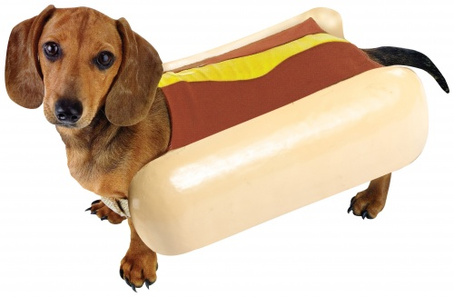
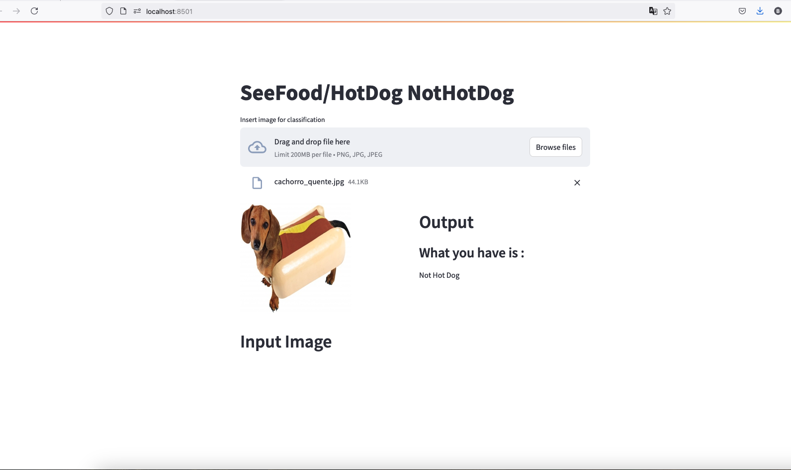

# SeeFood NotHotDog

## Overview

"SeeFood NotHotDog" is a machine-learning project inspired by the TV show Silicon Valley. The goal of the project is to create an application capable of identifying whether an image contains a hot dog or not, similar to the "SeeFood" app depicted in the show. This project utilizes TensorFlow/Keras to train and evaluate two different models: a custom Convolutional Neural Network (CNN) and a VGG16 pre-trained model. The best-performing model was then used to build a web application using Streamlit.

This project was developed as my capstone project as part of the IBM AI Engineering Specialization program [https://coursera.org/verify/profession al-cert/ZLAWTAB9L595].

## Models
### Custom CNN

The first model is a tailor-made CNN constructed from scratch. It consists of:

  - Four Conv2D layers: These layers apply convolution operations to the input images to detect various features.
  - Four MaxPooling2D layers: These layers perform down-sampling to reduce the dimensionality of the feature maps, which helps in reducing computational complexity and controlling overfitting.

### VGG16 Pre-trained Model

The second model is based on the VGG16 architecture, a well-known deep learning model pre-trained on the ImageNet dataset. This model was fine-tuned for the specific task of hot dog identification.

### Performance

Through extensive evaluation, it was observed that the VGG16-based model significantly outperformed the custom CNN in identifying hot dogs from a diverse dataset of food images.

### Web Application

The best-performing VGG16-based model was integrated into a web application built using Streamlit. This application allows users to upload images and get instant predictions on whether the image contains a hot dog or not.

## Prerequisites

  - Python 3.x
  - TensorFlow/Keras
  - NumPy
  - Matplotlib
  - Jupyter Notebook
  - Streamlit

## Web Application: 
To launch the web application, run:

    streamlit run app.py

Now try with your own images of food!
The web app should look like below

